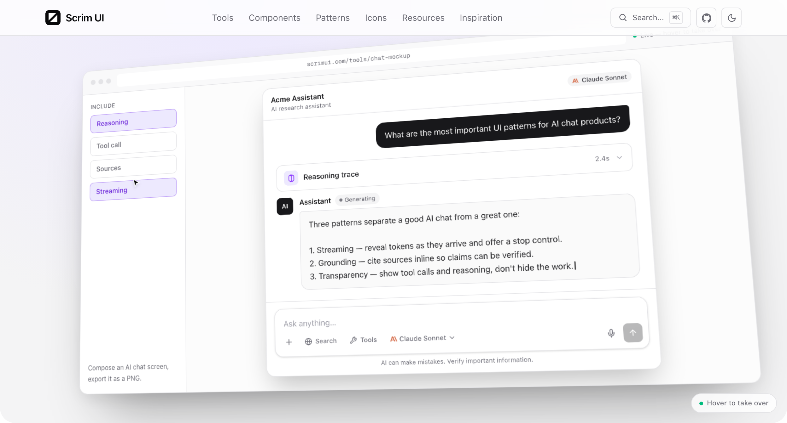
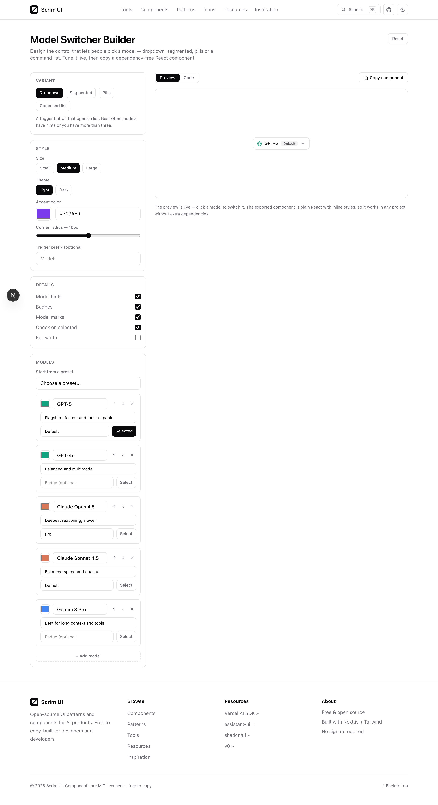

<div align="center">


# Scrim UI

**The UI layer your AI product is missing.**

Free in-browser tools and copy-ready components for AI interfaces — prompt
inputs, agent states, tool calls, citations, reasoning, voice and memory.

[scrimui.dev](https://scrimui.dev)


</div>

---

A scrim is the gauze that looks opaque until you light what is behind it. AI
products invented a whole vocabulary of interface in three years — streaming,
tool calls, reasoning traces, approval gates, context windows, memory — and
nobody wrote it down. This is the attempt: what each concept is called, what
icon it gets, what it looks like, what code it is, and when to use it.

## What it looks like

The homepage demo is live DOM — the same components the tool pages ship — driven by a scripted cursor. Hover anywhere to take over.



The [model switcher](https://scrimui.dev/tools/model-switcher) groups models by provider and regenerates the exported component as you change the props:



## Install a component

```bash
npx shadcn@latest add https://scrimui.dev/r/prompt-input.json
```

All 29 components are in the registry; the index is at
[`/r/registry.json`](https://scrimui.dev/r/registry.json).

Or skip the CLI entirely — every component page has the full source and a copy
button, and every component is **one file that imports nothing but React**. No
package to add, no version to track, no breaking change to absorb. Paste it and
it is yours.

## What is here

| | |
|---|---|
| **[Tools](https://scrimui.dev/tools)** | Nine in-browser tools. Compose a chat or voice mockup and export a PNG, generate a theme from one brand colour, count tokens and costs, frame a screenshot. Nothing uploads; it all runs locally. |
| **[Components](https://scrimui.dev/components)** | 29 single-file React + Tailwind components, each with a live prop explorer that regenerates the call site as you change it. |
| **[Patterns](https://scrimui.dev/patterns)** | Five whole screens — chat, research, coding agent, voice, preferences — assembled from those components. |
| **[Icons](https://scrimui.dev/icons)** | Lucide ships 2,034 icons and no opinion about which one means "tool call". This is that opinion: one icon per concept, each on a page where you can set size, stroke and colour before you copy it. |
| **[Resources](https://scrimui.dev/resources)** | A curated directory of 102 libraries, generators and guides, each with a note on why it is listed. |
| **[Inspiration](https://scrimui.dev/inspiration)** | Element-by-element breakdowns of ChatGPT, Claude, Perplexity and Cursor, plus decision guides — when to stream, when to pause for approval — each grounded in official docs. |

## Run it locally

```bash
npm install
npm run dev
```

Next.js App Router, Tailwind v4, TypeScript. No database, no API keys, no
environment variables required — every page is statically generated.

| | |
|---|---|
| `npm run dev` | Dev server on :3000 |
| `npm run build` | Production build. 253 static routes, including every OG card and registry entry |
| `npm run lint` | ESLint |
| `npx tsc --noEmit` | Types |
| `node scripts/contrast.mjs` | Checks the colour tokens against WCAG AA. Run it after touching `globals.css` |
| `npm run previews` | Re-captures the resource screenshots with Playwright. Slow, rarely needed |

Set `NEXT_PUBLIC_SITE_URL` to override the origin used by the sitemap,
canonical URLs and the registry.

## Layout

```
src/
  app/                     routes; opengraph-image.tsx and r/[name] are build-time generated
  showcase/<slug>/
    <slug>.tsx             the component — one file, React only, this is what ships
    demos.tsx              rendered examples
    controls.tsx           the prop schema the explorer drives
    page-config.tsx        usage notes and common mistakes
  components/
    site/                  header, footer, hero showcase, card previews
    tools/                 the ten browser tools
    component-page/        the explorer and code display
  lib/
    registry.ts            the component list — source of truth for the site and the registry
    icon-guide.ts          concept → Lucide icon
    resources.ts           the directory
    inspiration.ts         the articles
```

## Licence

Code is [MIT](LICENSE). Copy a component and you owe nothing — no attribution,
no link back.

The editorial content, the name and mark, and the third-party screenshots are
not MIT; [LICENSING.md](LICENSING.md) says exactly what is and is not covered.

Icons are from [Lucide](https://lucide.dev) under the ISC licence. The icons
are theirs; the concept-to-icon mapping is ours.
